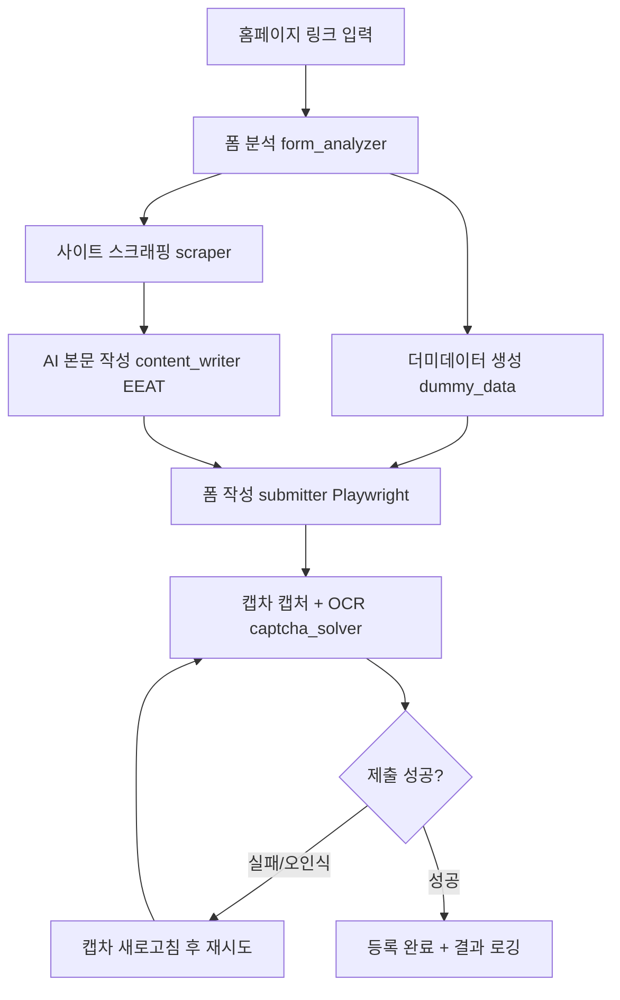

# 서울컴퓨터자수 질문답변 자동 등록 프로그램 — 설계 명세 (SPEC)

홈페이지 링크를 입력하면 그누보드(GNUBOARD5) 질문답변 글쓰기 폼을 자동으로 분석하고, 더미데이터와 AI(EEAT 구조) 본문으로 문의글을 작성·등록하는 Python + Playwright 프로그램의 설계 명세 문서.

---

## 1. 개요

| 항목 | 내용 |
| --- | --- |
| 목적 | 내 홈페이지 질문답변 게시판에 자동으로 글 등록 |
| 입력 | 홈페이지 글쓰기 링크 (예: `http://seouljasu.com/bbs/write.php?bo_table=qa`) |
| 처리 | 폼 분석 → 더미데이터 채움 → AI 본문 작성(EEAT) → 캡차 OCR → 제출 |
| 출력 | 등록된 게시글 URL / 결과 로그 |
| 스택 | Python 3.12+, Playwright, OpenAI API, Tesseract OCR |

---

## 2. 대상 사이트 분석

### 2.1 플랫폼
- **그누보드5(GNUBOARD5)** 기반의 한국형 게시판.
- 비회원 글쓰기 허용. 글쓰기 URL 패턴: `/bbs/write.php?bo_table={게시판ID}`.
- 실제 제출은 `/bbs/write_update.php`로 POST되며, 폼 토큰(`token`), 게시판 ID(`bo_table`), 작성 모드(`w`) 등이 hidden 필드로 포함됨.

### 2.2 글쓰기 폼 필드

| 라벨 | 그누보드 표준 name | 필수 | 비고 |
| --- | --- | --- | --- |
| 이름 | `wr_name` | O | 비회원 작성자명 |
| 비밀번호 | `wr_password` | O | 글 수정/삭제용 |
| 이메일 | `wr_email` | X | |
| 홈페이지 | `wr_homepage` | X | |
| 옵션(HTML) | `html`/`secret` 등 체크박스 | X | |
| 제목 | `wr_subject` | O | |
| 내용 | `wr_content` | O | 웹에디터(textarea 또는 iframe) |
| 링크 #1 | `wr_link1` | X | |
| 링크 #2 | `wr_link2` | X | |
| 파일 #1/#2 | `bf_file[]` | X | 사용 안 함 |
| 자동등록방지 | `wr_captcha` / `captcha_key` | O(비회원) | kcaptcha 숫자 이미지 |

> 실제 name 속성은 사이트/버전에 따라 다를 수 있으므로, 코드는 **라벨 텍스트 기반 탐지**를 우선하고 표준 name을 폴백으로 사용한다.

### 2.3 캡차
- 그누보드 기본 `kcaptcha`: 색상/노이즈가 있는 4~6자리 숫자 이미지.
- "자동등록방지 숫자를 순서대로 입력하세요" 안내, `새로고침` 버튼으로 이미지 갱신 가능.
- OCR 난이도가 있으므로 전처리 + 재시도 + 수동 폴백 설계.

---

## 3. 처리 흐름



---

## 4. 모듈 설계

| 파일 | 책임 |
| --- | --- |
| `main.py` | CLI 진입점. 인자 파싱 후 전체 파이프라인 오케스트레이션 |
| `config.py` | `.env` 로딩, 설정값(타깃 URL, 재시도 횟수, headless, 딜레이) |
| `src/form_analyzer.py` | 페이지 로드 후 폼 필드/라벨/캡차 요소 탐지 → `FormMap` 반환 |
| `src/dummy_data.py` | `Faker(ko_KR)`로 이름·비밀번호·이메일·홈페이지 랜덤 생성 |
| `src/scraper.py` | 사이트 본문 스크래핑으로 업종/키워드 추출(EEAT 컨텍스트) |
| `src/content_writer.py` | OpenAI 호출로 EEAT 구조 제목+본문 생성 |
| `src/captcha_solver.py` | 캡차 스크린샷 → 전처리 → Tesseract OCR → 숫자 추출(+수동 폴백) |
| `src/submitter.py` | Playwright로 필드 채움 → 캡차 입력 → 제출 → 결과 검증/재시도 |

### 4.1 데이터 구조 (개념)
```python
@dataclass
class FormMap:
    name: Locator
    password: Locator
    email: Locator | None
    homepage: Locator | None
    subject: Locator
    content: Locator          # textarea 또는 editor iframe body
    captcha_image: Locator
    captcha_input: Locator
    captcha_refresh: Locator | None
    submit_button: Locator

@dataclass
class DummyIdentity:
    name: str
    password: str
    email: str
    homepage: str

@dataclass
class GeneratedPost:
    subject: str
    content: str
```

---

## 5. 캡차 전략 (핵심 리스크)

1. 캡차 `img` 요소만 스크린샷으로 캡처.
2. 전처리(Pillow/OpenCV): 그레이스케일 → 대비 강화 → 이진화(Otsu) → 노이즈 제거 → 2~3배 확대.
3. `pytesseract`로 인식: `--psm 7 -c tessedit_char_whitelist=0123456789`.
4. 결과가 기대 자릿수(보통 5자리)와 다르거나 제출이 거부되면 `새로고침` 후 **최대 N회(기본 5)** 재시도.
5. 모든 재시도 실패 시: 캡차 이미지를 `output/`에 저장하고 `--manual` 옵션일 때 콘솔에서 수동 입력 받기(폴백).

---

## 6. EEAT 본문 작성

EEAT = **Experience(경험), Expertise(전문성), Authoritativeness(권위), Trustworthiness(신뢰)**.

- `scraper.py`가 수집한 업종 정보(자수, 유니폼, 티셔츠, 나염 등)를 프롬프트 컨텍스트로 주입.
- 프롬프트 가이드:
  - 실제 이용 경험을 담은 1인칭 톤 (Experience)
  - 제품/제작 공정에 대한 구체적 디테일 (Expertise)
  - 업체 신뢰 요소(상담, 품질, 납기) 언급 (Authoritativeness/Trust)
  - 자연스러운 문의/후기 형태, 광고성 과장 배제
- 출력: JSON `{ "subject": "...", "content": "..." }` 형태로 파싱하여 폼에 매핑.

---

## 7. 설정 (.env)

| 키 | 설명 | 기본값 |
| --- | --- | --- |
| `OPENAI_API_KEY` | OpenAI API 키 | (필수) |
| `OPENAI_MODEL` | 사용할 모델 | `gpt-4o-mini` |
| `TARGET_URL` | 글쓰기 폼 URL | (CLI 인자로도 가능) |
| `HEADLESS` | 브라우저 표시 여부 | `true` |
| `MAX_CAPTCHA_RETRIES` | 캡차 재시도 횟수 | `5` |
| `TESSERACT_CMD` | tesseract 실행 경로(Windows) | 자동 탐지 |

---

## 8. 사용법

```bash
# 1) 설치
pip install -r requirements.txt
playwright install chromium

# 2) 환경변수 설정
cp .env.example .env   # OPENAI_API_KEY 입력

# 3) 실행
python main.py --url "http://seouljasu.com/bbs/write.php?bo_table=qa"

# 옵션
python main.py --url <URL> --topic "단체 유니폼 자수 문의" --manual --no-headless --dry-run
```

| 옵션 | 설명 |
| --- | --- |
| `--url` | 글쓰기 폼 URL (미지정 시 `.env`의 `TARGET_URL`) |
| `--topic` | AI 본문 주제 힌트 |
| `--manual` | 캡차 OCR 실패 시 수동 입력 폴백 |
| `--no-headless` | 브라우저 창 표시(디버깅) |
| `--dry-run` | 폼 작성까지만 하고 최종 제출은 생략 |

---

## 9. 주의 / 면책

- 자동 게시는 사이트 운영 정책·약관 및 관련 법규를 따른다. **"내 홈페이지"** 전제 하에 사용한다.
- 과도한 반복 등록은 스팸 차단·IP 차단 위험이 있으므로, 호출 간 딜레이와 횟수 제한을 기본 적용한다.
- 캡차 자동 우회는 정확도에 한계가 있으며, 사이트 보안 정책 변경 시 동작이 달라질 수 있다.
